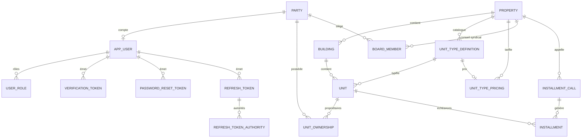

# Modèle de données — OIKOS API

Vue simplifiée des entités exposées par l'API et de leurs relations. Source : [V1__baseline.sql](../src/main/resources/db/migration/V1__baseline.sql).

Conventions communes à (presque) toutes les tables : `id` (UUID, généré côté application), `created_date`, `last_modified_date`, `version` (verrouillage optimiste). Ces colonnes sont omises ci-dessous pour la lisibilité.

## Vue d'ensemble

## Entités

### Party — `party`
Identité juridique d'un acteur (personne physique ou morale), indépendante de tout compte applicatif. Référencée par `app_user`, `unit_ownership` et `board_member`.

| Colonne | Type | Description |
|---|---|---|
| full_name | VARCHAR(200) | Nom complet |
| party_type | ENUM | `INDIVIDUAL`, `COMPANY` |
| email | VARCHAR(150) | Unique |
| phone | VARCHAR(20) | Unique, optionnel |

### AppUser — `app_user`
Identifiants de connexion uniquement ; l'identité (nom, email) vit sur le `Party` référencé.

| Colonne | Type | Description |
|---|---|---|
| party_id | UUID (FK) | → `party.id` |
| login | VARCHAR(150) | Unique, optionnel |
| password_hash | VARCHAR(255) | Hash BCrypt |
| verified | BOOLEAN | Email vérifié |
| enabled | BOOLEAN | Compte actif |

- **UserRole — `user_role`** : table pivot `(user_id, role)`. Rôles possibles : `ROLE_USER`, `ROLE_PROPERTY_MANAGER`, `ROLE_ADMIN`, `ROLE_MASTER`.
- **VerificationToken — `verification_token`** : jeton de vérification d'email (`user_id`, `token`, `expires_at`).
- **PasswordResetToken — `password_reset_token`** : jeton de réinitialisation de mot de passe (`user_id`, `token`, `expires_at`).
- **RefreshToken — `refresh_token`** : jeton de rafraîchissement JWT (`user_id`, `token_hash`, `expires_at`, `revoked`), avec `refresh_token_authority` en pivot des autorités associées.

### Property — `property`
Copropriété gérée. Racine de la structure (bâtiments, types de lots, conseil syndical, appels de fonds).

| Colonne | Type | Description |
|---|---|---|
| name | VARCHAR(100) | Nom |
| address | VARCHAR(250) | Adresse |

### Building — `building`
Bâtiment d'une `Property`.

| Colonne | Type | Description |
|---|---|---|
| property_id | UUID (FK) | → `property.id` |
| name | VARCHAR(100) | Nom |
| floor_count | INTEGER | Nombre d'étages |

### UnitTypeDefinition — `unit_type_definition`
Catalogue de types de lots propre à une `Property` (ex. "Appartement", "Box"). Un type `OTHERS` par défaut est créé à la création de la propriété.

| Colonne | Type | Description |
|---|---|---|
| property_id | UUID (FK) | → `property.id` |
| name | VARCHAR(50) | Unique par propriété |

### Unit — `unit`
Lot au sein d'un `Building`, typé via `UnitTypeDefinition`.

| Colonne | Type | Description |
|---|---|---|
| building_id | UUID (FK) | → `building.id` |
| unit_number | VARCHAR(20) | Numéro de lot |
| unit_type_id | UUID (FK) | → `unit_type_definition.id` |
| shares | NUMERIC(12,2) | Tantièmes |

### UnitTypePricing — `unit_type_pricing`
Prix optionnel par type de lot pour une propriété donnée (au plus une ligne par type ; absence = pas de prix configuré, pas d'erreur). Supprimée en cascade avec le type de lot.

| Colonne | Type | Description |
|---|---|---|
| property_id | UUID (FK) | → `property.id` |
| unit_type_id | UUID (FK, unique) | → `unit_type_definition.id` |
| price | NUMERIC(12,2) | Prix |

### UnitOwnership — `unit_ownership`
Pivot lot ↔ propriétaire (`Party`), avec quote-part de propriété. Un lot peut avoir plusieurs propriétaires.

| Colonne | Type | Description |
|---|---|---|
| unit_id | UUID (FK) | → `unit.id` |
| party_id | UUID (FK) | → `party.id` |
| ownership_share | NUMERIC(5,2) | Quote-part (%) |

Contrainte unique `(unit_id, party_id)`.

### BoardMember — `board_member`
Pivot conseil syndical : rattache un `Party` à une `Property` avec un rôle.

| Colonne | Type | Description |
|---|---|---|
| property_id | UUID (FK) | → `property.id` |
| party_id | UUID (FK) | → `party.id` |
| board_role | ENUM | `PRESIDENT`, `TREASURER`, `SECRETARY`, `MEMBER`, `VOLUNTEER_MANAGER`, `PROPERTY_MANAGER` |

Contrainte unique `(property_id, party_id, board_role)`.

### InstallmentCall — `installment_call`
Événement d'appel de fonds (cotisation) pour une `Property` sur une période (mois) donnée. Génère une `Installment` pour chaque lot tarifé de la propriété.

| Colonne | Type | Description |
|---|---|---|
| property_id | UUID (FK) | → `property.id` |
| period | DATE | Mois concerné |
| due_date | DATE | Date d'échéance |

Contrainte unique `(property_id, period)` — empêche un double appel pour le même mois.

### Installment — `installment`
Échéance due par un `Unit`, éventuellement rattachée à un `InstallmentCall` (nullable : le flux manuel `POST /installment-calls` permet des lignes arbitraires non rattachées à un batch).

| Colonne | Type | Description |
|---|---|---|
| unit_id | UUID (FK) | → `unit.id` |
| due_date | DATE | Date d'échéance |
| amount | NUMERIC(12,2) | Montant |
| installment_call_id | UUID (FK, nullable) | → `installment_call.id` |

## Relations clés à retenir

- **Party est le socle d'identité** : `AppUser`, `UnitOwnership` et `BoardMember` référencent tous `Party`, jamais l'inverse — un `Party` peut exister sans compte applicatif (ex. copropriétaire sans accès à la plateforme).
- **Un lot (`Unit`) peut avoir plusieurs propriétaires** via `UnitOwnership`, chacun avec sa quote-part.
- **Le tarif est optionnel et par type de lot**, pas par lot individuel : `UnitTypePricing` est unique par `unit_type_id`.
- **Les appels de fonds sont mensuels et uniques par propriété** (`installment_call.property_id + period`), et chaque appel démultiplie une `Installment` par lot tarifé.
