# Modèle de données — OIKOS API

Vue simplifiée des entités exposées par l'API et de leurs relations. Source : [V1__baseline.sql](../src/main/resources/db/migration/V1__baseline.sql).

Conventions communes à (presque) toutes les tables : `id` (UUID, généré côté application), `created_date`, `last_modified_date`, `version` (verrouillage optimiste). Ces colonnes sont omises ci-dessous pour la lisibilité.

## Vue d'ensemble

```mermaid
erDiagram
    PARTY ||--o| APP_USER : "compte"
    PARTY ||--o{ UNIT_OWNERSHIP : "possède"
    PARTY ||--o{ BOARD_MEMBER : "siège"

    APP_USER ||--o{ USER_ROLE : "rôles"
    APP_USER ||--o{ VERIFICATION_TOKEN : "émet"
    APP_USER ||--o{ PASSWORD_RESET_TOKEN : "émet"
    APP_USER ||--o{ REFRESH_TOKEN : "émet"
    REFRESH_TOKEN ||--o{ REFRESH_TOKEN_AUTHORITY : "autorités"

    PROPERTY ||--o{ BUILDING : "contient"
    PROPERTY ||--o{ UNIT_TYPE_DEFINITION : "catalogue"
    PROPERTY ||--o{ UNIT_TYPE_PRICING : "tarifie"
    PROPERTY ||--o{ BOARD_MEMBER : "conseil syndical"
    PROPERTY ||--o{ INSTALLMENT_CALL : "appelle"

    BUILDING ||--o{ UNIT : "contient"
    UNIT_TYPE_DEFINITION ||--o{ UNIT : "typifie"
    UNIT_TYPE_DEFINITION ||--o| UNIT_TYPE_PRICING : "prix"
    UNIT ||--o{ UNIT_OWNERSHIP : "propriétaires"
    UNIT ||--o{ INSTALLMENT : "échéances"

    INSTALLMENT_CALL ||--o{ INSTALLMENT : "génère"

    PROPERTY ||--o{ GENERAL_MEETING : "assemblées générales"
    PROPERTY ||--o{ MEETING_QUORUM_SETTING : "quorum par nature d'AG"
    GENERAL_MEETING ||--o{ AGENDA_ITEM : "ordre du jour"
    GENERAL_MEETING ||--o{ CONVOCATION : "convoque"
    GENERAL_MEETING ||--o| MEETING_MINUTES : "procès-verbal"
    UNIT ||--o{ CONVOCATION : "convoqué"
    AGENDA_ITEM ||--o{ VOTE : "votes"
    UNIT ||--o{ VOTE : "vote"

    PROPERTY ||--o{ CONVERSATION : "messagerie"
    APP_USER ||--o{ CONVERSATION : "démarre"
    CONVERSATION ||--o{ MESSAGE : "contient"
    APP_USER ||--o{ MESSAGE : "envoie"
    CONVERSATION ||--o{ CONVERSATION_READ_MARKER : "suivi de lecture"
    APP_USER ||--o{ CONVERSATION_READ_MARKER : "marque lu"
```

## Entités

### Party — `party`
Identité juridique d'un acteur (personne physique ou morale), indépendante de tout compte applicatif. Référencée par `app_user`, `unit_ownership` et `board_member`.

| Colonne | Type | Description |
|---|---|---|
| full_name | VARCHAR(200) | Nom complet |
| party_type | ENUM | `INDIVIDUAL`, `COMPANY` |
| email | VARCHAR(150) | Unique |
| phone | VARCHAR(20) | Unique, optionnel |

### AppUser — `app_user`
Identifiants de connexion uniquement ; l'identité (nom, email) vit sur le `Party` référencé.

| Colonne | Type | Description |
|---|---|---|
| party_id | UUID (FK) | → `party.id` |
| login | VARCHAR(150) | Unique, optionnel |
| password_hash | VARCHAR(255) | Hash BCrypt |
| verified | BOOLEAN | Email vérifié |
| enabled | BOOLEAN | Compte actif |

- **UserRole — `user_role`** : table pivot `(user_id, role)`. Rôles possibles : `ROLE_USER`, `ROLE_PROPERTY_MANAGER`, `ROLE_ADMIN`, `ROLE_MASTER`.
- **VerificationToken — `verification_token`** : jeton de vérification d'email (`user_id`, `token`, `expires_at`).
- **PasswordResetToken — `password_reset_token`** : jeton de réinitialisation de mot de passe (`user_id`, `token`, `expires_at`).
- **RefreshToken — `refresh_token`** : jeton de rafraîchissement JWT (`user_id`, `token_hash`, `expires_at`, `revoked`), avec `refresh_token_authority` en pivot des autorités associées.

### Property — `property`
Copropriété gérée. Racine de la structure (bâtiments, types de lots, conseil syndical, appels de fonds).

| Colonne | Type | Description |
|---|---|---|
| name | VARCHAR(100) | Nom |
| address | VARCHAR(250) | Adresse |

### Building — `building`
Bâtiment d'une `Property`.

| Colonne | Type | Description |
|---|---|---|
| property_id | UUID (FK) | → `property.id` |
| name | VARCHAR(100) | Nom |
| floor_count | INTEGER | Nombre d'étages |

### UnitTypeDefinition — `unit_type_definition`
Catalogue de types de lots propre à une `Property` (ex. "Appartement", "Box"). Un type `OTHERS` par défaut est créé à la création de la propriété.

| Colonne | Type | Description |
|---|---|---|
| property_id | UUID (FK) | → `property.id` |
| name | VARCHAR(50) | Unique par propriété |

### Unit — `unit`
Lot au sein d'un `Building`, typé via `UnitTypeDefinition`.

| Colonne | Type | Description |
|---|---|---|
| building_id | UUID (FK) | → `building.id` |
| unit_number | VARCHAR(20) | Numéro de lot |
| unit_type_id | UUID (FK) | → `unit_type_definition.id` |
| shares | NUMERIC(12,2) | Tantièmes |

### UnitTypePricing — `unit_type_pricing`
Prix optionnel par type de lot pour une propriété donnée (au plus une ligne par type ; absence = pas de prix configuré, pas d'erreur). Supprimée en cascade avec le type de lot.

| Colonne | Type | Description |
|---|---|---|
| property_id | UUID (FK) | → `property.id` |
| unit_type_id | UUID (FK, unique) | → `unit_type_definition.id` |
| price | NUMERIC(12,2) | Prix |

### UnitOwnership — `unit_ownership`
Pivot lot ↔ propriétaire (`Party`), avec quote-part de propriété. Un lot peut avoir plusieurs propriétaires.

| Colonne | Type | Description |
|---|---|---|
| unit_id | UUID (FK) | → `unit.id` |
| party_id | UUID (FK) | → `party.id` |
| ownership_share | NUMERIC(5,2) | Quote-part (%) |

Contrainte unique `(unit_id, party_id)`.

### BoardMember — `board_member`
Pivot conseil syndical : rattache un `Party` à une `Property` avec un rôle.

| Colonne | Type | Description |
|---|---|---|
| property_id | UUID (FK) | → `property.id` |
| party_id | UUID (FK) | → `party.id` |
| board_role | ENUM | `PRESIDENT`, `TREASURER`, `SECRETARY`, `MEMBER`, `VOLUNTEER_MANAGER`, `PROPERTY_MANAGER` |

Contrainte unique `(property_id, party_id, board_role)`.

### InstallmentCall — `installment_call`
Événement d'appel de fonds (cotisation) pour une `Property` sur une période (mois) donnée. Génère une `Installment` pour chaque lot tarifé de la propriété.

| Colonne | Type | Description |
|---|---|---|
| property_id | UUID (FK) | → `property.id` |
| period | DATE | Mois concerné |
| due_date | DATE | Date d'échéance |

Contrainte unique `(property_id, period)` — empêche un double appel pour le même mois.

### Installment — `installment`
Échéance due par un `Unit`, éventuellement rattachée à un `InstallmentCall` (nullable : le flux manuel `POST /installment-calls` permet des lignes arbitraires non rattachées à un batch).

| Colonne | Type | Description |
|---|---|---|
| unit_id | UUID (FK) | → `unit.id` |
| due_date | DATE | Date d'échéance |
| amount | NUMERIC(12,2) | Montant |
| installment_call_id | UUID (FK, nullable) | → `installment_call.id` |

### Conversation — `conversation`
Fil de discussion rattaché à une `Property` : `GROUP` (2..N participants choisis applicativement par l'émetteur, façon Outlook "Nouveau message" — jamais réutilisée : composer vers le même ensemble de destinataires crée toujours une nouvelle conversation) ou `BROADCAST` (canal d'annonces persistant, unique par propriété, membres résolus dynamiquement à la lecture — jamais stockés).

| Colonne | Type | Description |
|---|---|---|
| property_id | UUID (FK) | → `property.id` |
| type | ENUM | `GROUP`, `BROADCAST` |
| created_by | UUID (FK) | → `app_user.id` |

Contrainte unique `(property_id)` pour `BROADCAST` (au plus un canal de diffusion par propriété) ; `GROUP` n'a aucune contrainte d'unicité sur ses participants.

### ConversationParticipant — `conversation_participant`
Table de jointure listant les participants d'une conversation `GROUP` (une ligne par couple conversation/utilisateur) ; toujours vide pour `BROADCAST`, dont l'appartenance est résolue dynamiquement plutôt que stockée.

| Colonne | Type | Description |
|---|---|---|
| conversation_id | UUID (FK) | → `conversation.id` |
| user_id | UUID (FK) | → `app_user.id` |

Clé primaire composite `(conversation_id, user_id)`.

### Message — `message`
Message immuable posté dans une `Conversation` (jamais modifié ni supprimé, pas de `last_modified_date`/`version`).

| Colonne | Type | Description |
|---|---|---|
| conversation_id | UUID (FK) | → `conversation.id` |
| sender_id | UUID (FK) | → `app_user.id` |
| body | TEXT | Contenu (max 4000 caractères, validé applicativement) |

### ConversationReadMarker — `conversation_read_marker`
Curseur de lecture par utilisateur et par conversation, créé paresseusement (upsert) au premier accès.

| Colonne | Type | Description |
|---|---|---|
| conversation_id | UUID (FK) | → `conversation.id` |
| user_id | UUID (FK) | → `app_user.id` |
| last_read_message_id | UUID (FK, nullable) | → `message.id` |
| last_read_at | TIMESTAMPTZ (nullable) | |

Clé primaire composite `(conversation_id, user_id)`.

### GeneralMeeting — `general_meeting`
Assemblée générale d'une `Property`. Cycle de vie en six statuts porté par l'agrégat ; les colonnes `quorum_percentage` et `voting_weight_mode` sont des **snapshots** figés à la création (voir [ADR 0002](adr/0002-assemblee-generale-cadrage.md)).

| Colonne | Type | Description |
|---|---|---|
| property_id | UUID (FK) | → `property.id` |
| meeting_type | ENUM | `ORDINARY`, `EXTRAORDINARY` |
| status | ENUM | `DRAFT`, `SCHEDULED`, `CONVENED`, `IN_PROGRESS`, `CLOSED`, `MINUTES_PUBLISHED` |
| title | VARCHAR(200) | Intitulé de la séance |
| scheduled_at | TIMESTAMPTZ (nullable) | Date et heure ; obligatoire dès la sortie de `DRAFT` |
| venue_type | ENUM (nullable) | `PHYSICAL`, `VIDEOCONFERENCE`, `HYBRID` |
| venue_address / venue_link | VARCHAR | Adresse et/ou lien, selon `venue_type` |
| quorum_percentage | NUMERIC(5,2) | Snapshot de `meeting_quorum_setting` |
| public_reference | VARCHAR(6), **unique**, NOT NULL | Référence publique de l'assemblée, saisie avec le code de confirmation. Publique par construction — imprimée à côté du code, elle ne protège rien, elle adresse |
| comment | TEXT (nullable) | Commentaire global de l'AG, HTML d'éditeur riche. Lu par les copropriétaires (espace, mobile, PDF de convocation) — jamais réinjecté brut : assaini côté clients, aplati en texte pour le PDF (ADR 0002 §12) |
| voting_weight_mode | ENUM | `PER_UNIT`, `SHARES` — snapshot de `property.dues_calculation_mode` |
| opened_without_quorum | BOOLEAN | Séance ouverte malgré un quorum non atteint (acte tracé) |

### MeetingQuorumSetting — `meeting_quorum_setting`
Seuil de quorum réglable par copropriété et par nature d'AG. Absence de ligne = aucun quorum exigé.

| Colonne | Type | Description |
|---|---|---|
| property_id | UUID (FK) | → `property.id` |
| meeting_type | ENUM | `ORDINARY`, `EXTRAORDINARY` |
| quorum_percentage | NUMERIC(5,2) | 0 à 100 |

Contrainte unique `(property_id, meeting_type)`.

### AgendaItem — `agenda_item`
Point de l'ordre du jour. Aucune colonne de résultat : le dépouillement est recalculé depuis `vote` à la lecture, et figé une seule fois dans le contenu du PV.

| Colonne | Type | Description |
|---|---|---|
| general_meeting_id | UUID (FK) | → `general_meeting.id` |
| label / description | VARCHAR(200) / TEXT | |
| position | INTEGER | Unique par AG, contrainte `DEFERRABLE` (un réordonnancement permute les positions) |
| majority_rule | ENUM | `SIMPLE`, `ABSOLUTE`, `UNANIMITY` — choisie point par point |
| vote_session_status | ENUM | `NOT_OPENED`, `OPEN`, `CLOSED` |

### Convocation — `convocation`
Parcours complet d'un **lot** pour une AG : envoi, confirmation, émargement (objet unique, comme dans la SFD). Le sujet est le lot et non le copropriétaire — un lot en indivision reçoit une seule convocation et n'a qu'une voix. Les destinataires effectifs ne sont pas stockés : ils sont résolus à l'envoi depuis les `unit_ownership` courants.

| Colonne | Type | Description |
|---|---|---|
| general_meeting_id | UUID (FK) | → `general_meeting.id` |
| unit_id | UUID (FK) | → `unit.id` |
| voting_weight | NUMERIC(12,2) | Snapshot : `1` en mode `PER_UNIT`, tantièmes du lot en mode `SHARES` |
| attendance_reply / replied_at | ENUM / TIMESTAMPTZ | `ATTENDING`, `NOT_ATTENDING`, `NO_REPLY` (défaut, pas `NULL`) |
| reply_source | ENUM (nullable) | `OWNER_APP`, `OWNER_LINK`, `OTHER` — **comment** la confirmation a été obtenue. Déduite de l'appelant côté serveur, jamais envoyée par le client. `OTHER` dit seulement qu'aucun des deux chemins applicatifs n'a été emprunté ; par quel moyen elle est alors arrivée est `reply_medium` |
| reply_medium | VARCHAR(30) (FK, nullable) | → `reply_medium.code`. Par quel moyen la réponse est parvenue au bureau (`TELEPHONE`, `COURRIER`, `EMAIL`, `GUICHET`). **Déclaré par le client**, contrairement à `reply_source` : seule la personne qui a pris l'appel le sait. `CHECK` : non nul uniquement si `reply_source = 'OTHER'` |
| replied_by_party_id | UUID (FK, nullable) | → `party.id` — qui a répondu, quand c'est connu |
| reply_note | VARCHAR(500) (nullable) | La précision que le syndic garderait sinon sur un post-it (« appelée mardi »). Le moyen, lui, est structuré dans `reply_medium` |
| confirmation_code | VARCHAR(6), NOT NULL, **unique par `(general_meeting_id, …)`** | Code à recopier depuis la lettre (`w754a1`). Alphabet `[0-9a-z]` moins `l`/`o`. Unique **par AG** seulement : il se présente toujours avec `general_meeting.public_reference`, et c'est ce couplage qui borne l'espace de recherche (ADR 0002 §13). Absent des réponses de liste, présent sur `GET /convocations/{id}` |
| confirmation_token | VARCHAR(64), **unique**, NOT NULL | Jeton du lien de confirmation (32 octets `SecureRandom`, Base64-url). Créé à la génération, pas à l'envoi : le lien s'imprime sur la lettre postée. Unique par construction — c'est la seule chose que présente un visiteur anonyme, donc la seule chose qui désigne la convocation. N'apparaît dans aucune réponse JSON du back-office (ADR 0002 §10) |
| checked_in / checked_in_at | BOOLEAN / TIMESTAMPTZ | Émargement ; condition nécessaire au vote du lot |
| attendance_mode | ENUM (nullable) | `ON_SITE`, `REMOTE` |
| checked_in_party_id | UUID (FK, nullable) | → `party.id` — qui représentait le lot (pas un mandat) |

Contrainte unique `(general_meeting_id, unit_id)`. Contrainte `CHECK` : une réponse enregistrée porte forcément sa source, une absence de réponse n'en a aucune.

**Pas de colonne `channel`, `sent_at` ni `delivery_status`** (retirées en `V6`) : l'envoi est une liste de `convocation_delivery`, et les deux valeurs de synthèse dont les écrans ont besoin sont dérivées à la lecture (aucune ligne → `TO_SEND` ; au moins une `SENT` → `SENT` ; que des `FAILED` → `FAILED` ; `sentAt` = date du **premier** envoi abouti, celle dont court le délai de convocation).

### Canal de convocation — `convocation_channel`
Table de **référence** (comme `journal`), globale et non scopée par `property` : les canaux sont ceux du produit. Ajouter un canal doit être un `INSERT`, pas un déploiement — même bascule que `UnitType` (enum figé) → `unit_type_definition`.

| Colonne | Type | Description |
|---|---|---|
| code | VARCHAR(30) (PK) | `EMAIL`, `APP`, `POSTAL_MAIL`, `REGISTERED_MAIL`, `MANUAL` |
| label | VARCHAR(100) | Libellé affiché — le serveur le résout, aucun client n'en garde de copie |
| automated | BOOLEAN | L'application sait envoyer elle-même. Un canal manuel s'ajoute par un `INSERT` seul ; un canal `automated` exige **en plus** un émetteur dans le code, faute de quoi `SendConvocationUseCase` le refuse |
| position / active | INTEGER / BOOLEAN | Ordre d'affichage ; une ligne désactivée reste référencée par les envois passés |

Semé deux fois : par `V6` (prod/docker) et par `V7` sous forme rejouable, chargé par le profil dev via `spring.sql.init` — H2 n'applique jamais les migrations. `ConvocationChannelSeedTest` interdit la dérive entre les deux.

### Envoi de convocation — `convocation_delivery`
Une ligne par tentative d'envoi, aboutie ou non. **1—N** avec `convocation` : la même convocation part légitimement par plusieurs canaux (email, puis recommandé pour le lot resté muet), et l'ancienne forme — un seul triplet porté par la convocation — écrasait la précédente à chaque fois. Un échec est conservé : « on a essayé par email, il n'y avait pas d'adresse » est ce qui dit au syndic de poster une lettre, et devient indiscernable de « personne n'a essayé » si on le jette.

| Colonne | Type | Description |
|---|---|---|
| convocation_id | UUID (FK) | → `convocation.id`, `ON DELETE CASCADE` |
| channel_code | VARCHAR(30) (FK) | → `convocation_channel.code` |
| status | VARCHAR(20) | `SENT` ou `FAILED` seulement — `TO_SEND` est l'absence de ligne, jamais une ligne |
| sent_at | TIMESTAMPTZ (nullable) | `CHECK` : renseignée si et seulement si `SENT` |
| reference | VARCHAR(100) (nullable) | N° de suivi d'un recommandé — le seul canal qui en produit un |
| recorded_by_user_id | UUID (nullable) | Qui a envoyé, ou qui a constaté la remise |

**Pas d'unicité sur `(convocation, canal)`** : renvoyer par le même canal après un échec est une seconde tentative, et les deux méritent d'être lisibles.

### Vote — `vote`
Vote d'un **lot** sur un point de l'ordre du jour. `cast_by_user_id` ne trace que la saisie, jamais la détention de la voix.

| Colonne | Type | Description |
|---|---|---|
| agenda_item_id | UUID (FK) | → `agenda_item.id` |
| unit_id | UUID (FK) | → `unit.id` |
| choice | ENUM | `FOR`, `AGAINST`, `ABSTENTION` |
| cast_at | TIMESTAMPTZ | |
| cast_by_user_id | UUID (FK, nullable) | → `app_user.id` |

Contrainte unique `(agenda_item_id, unit_id)`.

### MeetingMinutes — `meeting_minutes`
Procès-verbal, relation 1—1 avec l'AG. Le PDF final n'est pas une colonne : il est stocké par le module `document` (`DocumentOwnerType.MEETING_MINUTES`), comme le reçu de paiement.

| Colonne | Type | Description |
|---|---|---|
| general_meeting_id | UUID (FK, unique) | → `general_meeting.id` |
| content | TEXT | Présents, résultats de vote, décisions — c'est ici que le dépouillement est figé |
| status | ENUM | `DRAFT`, `UNDER_REVIEW`, `PUBLISHED` |
| published_at | TIMESTAMPTZ (nullable) | Obligatoire dès `PUBLISHED` |

## Relations clés à retenir

- **Party est le socle d'identité** : `AppUser`, `UnitOwnership` et `BoardMember` référencent tous `Party`, jamais l'inverse — un `Party` peut exister sans compte applicatif (ex. copropriétaire sans accès à la plateforme).
- **Un lot (`Unit`) peut avoir plusieurs propriétaires** via `UnitOwnership`, chacun avec sa quote-part.
- **Le tarif est optionnel et par type de lot**, pas par lot individuel : `UnitTypePricing` est unique par `unit_type_id`.
- **Les appels de fonds sont mensuels et uniques par propriété** (`installment_call.property_id + period`), et chaque appel démultiplie une `Installment` par lot tarifé.
- **En assemblée générale, c'est le lot qui est convoqué et qui vote**, jamais le `Party` : `convocation` et `vote` référencent `unit`, avec un poids de voix snapshoté à la génération des convocations. Un lot sans `unit_ownership` est convoqué quand même — il compte dans le total des voix (quorum, majorité absolue) sans pouvoir répondre ni émarger.
